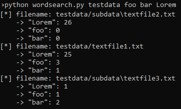

# python scripts for text-analysis
## About
This repository contains a collection of python scripts for *text-analysis*. The project was created as an exercise to demonstrate python functionality.

These scripts are written in Python 2.7.

## Content
### wordsearch
`wordsearch.py`: search and count multiple words in multiple files

```
python wordsearch.py <folder> <word1> [<word2> ... <wordN>]
python wordsearch.py testdata foo bar Lorem
```



*Note: further text-analysis scripts are under development*
